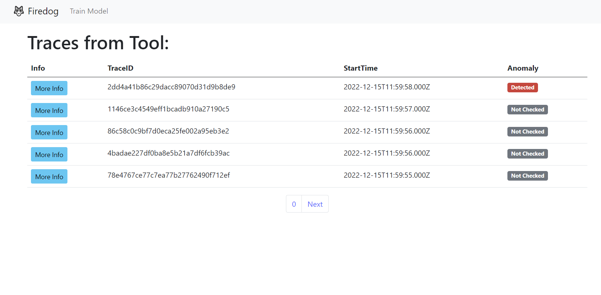
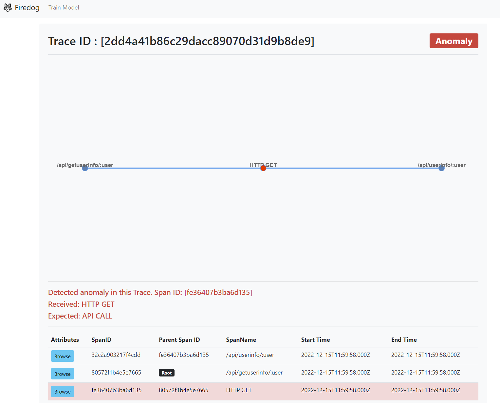

# FireDogCollector
>FireDogCollector is a Full stack OpenTelemetry collector powered by Deep Learning and AI to detect recorded anomalies in real-time. 
>Additionally, the system will indicate the probable source of failure with the help of attribute occurrence statistics.
>
> **Note: The project is being implemented as a Master's Thesis at the Department of Computer Systems Architecture at the Gdańsk University of Technology
>The aim of the master's thesis is to create a fully locally operating useful and new anomaly detection system using artificial intelligence.**

## General Information
- The system collects telemetry from [OpenTelemetry](https://opentelemetry.io/) standard. Click to learn more about traces and telemetry
- An example of instrumented distributed system is in [this repository](https://github.com/My5z0n/SampleInstrumentationApp)
- System uses Recursive Neural Networks implemented in form of LSTM gates from [Tensorflow](https://www.tensorflow.org/) to validate anomaly in traces

## Microservice Structure
The system consists of microservice modules:
- OTelCollector Collects traces from OpenTelemetry Collector and saves them to DB
- [ClickHouse Database](https://clickhouse.com/) is fast OLAP columnnar data storage which i able to handle written traces in any form with any number of attributes
- Backend is responsible for serving API for frontend client
- Frontent Client is Svelte APP serving application to end consumers.
- [Rabbitmq](https://www.rabbitmq.com/) to support communication between services 

## Screenshots

## Setup
To get started download source code and dev tools such: Python, Go, Docker, Node.js,
For database it is recommended that Clickhouse will be used using [docker image](https://hub.docker.com/r/clickhouse/clickhouse-server/)
and [RabbitMQ](https://hub.docker.com/_/rabbitmq)
Next all necessery tables for DB are written in ops/*.sql files 

Next complie & run Go backend and Collector. Run main.py ML service. And run Svlete frontend using command:
`npm run dev -- --open`

Pip packages necessery for MLService:
- tensorflow
- numpy
- pickle
- pika
- clickhouse_connect

## Acknowledgements
This project is under heavy development, and some parts may not work currently properly or may change.

## Contact
Created by Szymon Nagel szmnnagel@gmail.com  - feel free to contact me if you want to learn more about this project and it's potential

